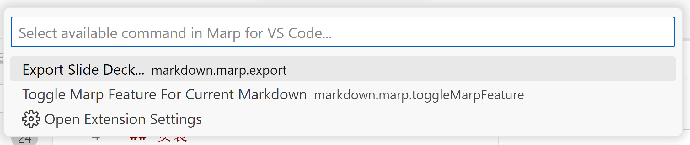

## 概述
marp是一个利用MarkDown文档创建的工具。
你可以利用VScode+插件的形式使用marp。
## 安装
首先你需要下载和安装VScode。然后在扩展商店中找到Marp for VS Code安装。


### 使用

安装后就可以在编辑.md文档时，点击顶部的按钮来触发顶部快捷面板。


其中会显示两个选项：



- 第一个选项用于导出PDF、PPT等。
- 第二个选项则用于在当前文档切换marp的使用。

这会在.md顶部创建一个如下的YAML头，其中记录文档元信息。
```yaml
---
marp: true
---
```
只要marp字段被设为true，则当前.md文档就被认为是marp形式，就会在预览窗口以PPT形式显示。

### 创建分页
marp使用`---`也就是MarkDown中的水平分割线作为分页。

```markdown
---
marp: true
---

这里是第一页

---
```
效果如下：


```markdown
---
marp: true
---

# 这里是第一页

假装做一个PPT

---
```

